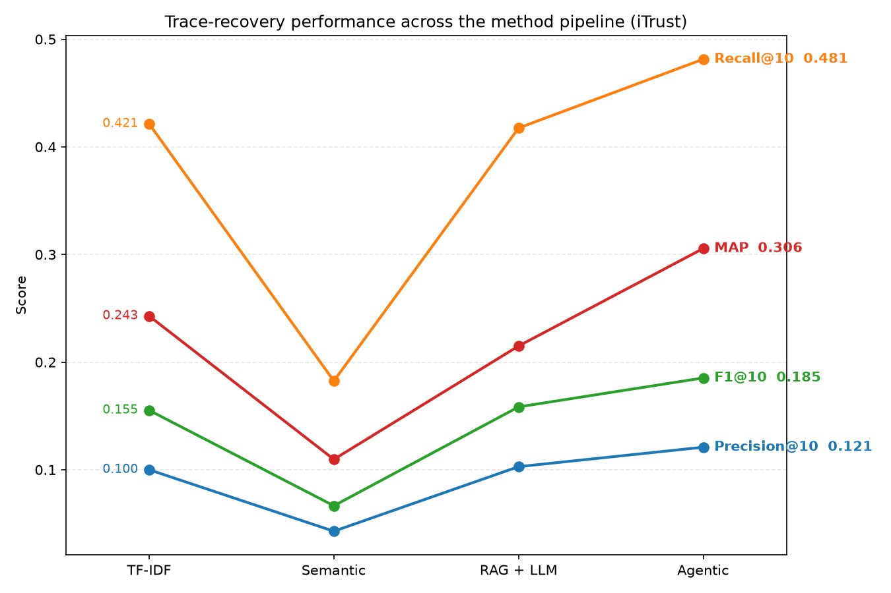
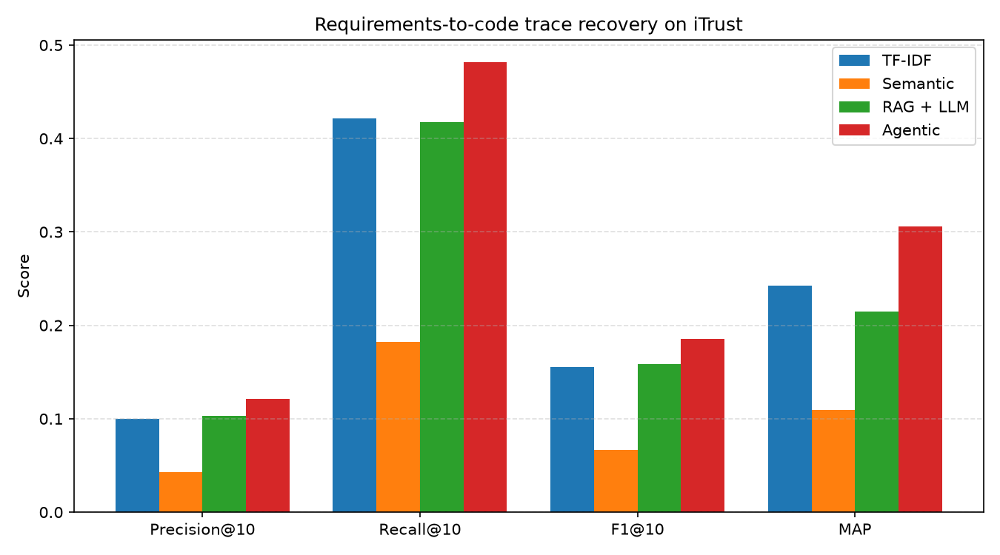
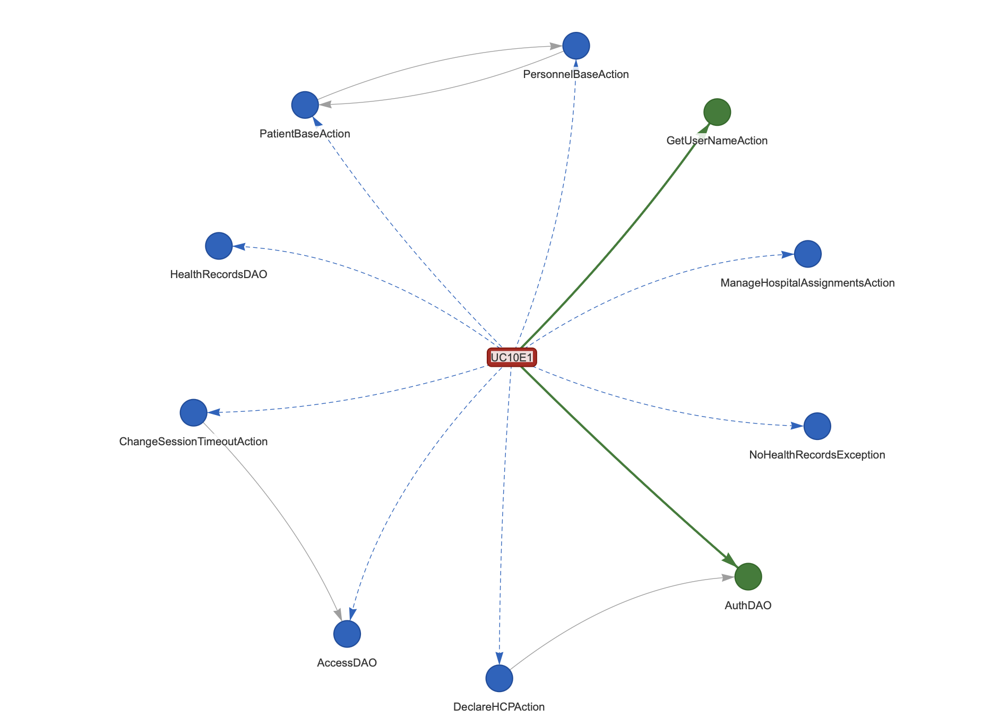

# RAG + Agentic Requirements Traceability

Automatically recover trace links between software requirements and code using
retrieval, retrieval-augmented LLM verification, and an agentic layer that
gathers context before deciding. Evaluated on the CoEST **iTrust** benchmark
against a gold-standard trace matrix.

## Motivation

Trace links connect requirements to the code that implements them. They are
essential for impact analysis, compliance and maintenance, but creating and
maintaining them by hand is costly, so in practice they are often incomplete or
missing. This project studies whether modern retrieval and LLM techniques can
recover them automatically, and how much each successive technique actually
contributes.

## Methods

Four methods of increasing sophistication, each evaluated with the same metrics:

1. **TF-IDF baseline** — classical vector-space retrieval by cosine similarity.
2. **Semantic retrieval** — `nomic-embed-text` embeddings (via Ollama) stored in
   ChromaDB.
3. **RAG + LLM verification** — a local LLM (`llama3.2:3b`) verifies retrieved
   candidates with a verdict and confidence.
4. **Agentic layer** — a verifier agent expands each candidate to the classes it
   references and folds discovered classes back into the candidate set,
   recovering indirect links.

## Headline result

On iTrust (105 requirements with gold links, 226 Java artefacts), the agentic
layer is the only method to beat the TF-IDF baseline on every metric, and lifts
MAP by roughly 26%.

| Method      | Precision@10 | Recall@10 | F1@10  | MAP    |
|-------------|--------------|-----------|--------|--------|
| TF-IDF      | 0.100        | 0.421     | 0.155  | 0.243  |
| Semantic    | 0.043        | 0.183     | 0.067  | 0.110  |
| RAG + LLM   | 0.103        | 0.418     | 0.158  | 0.215  |
| **Agentic** | **0.121**    | **0.481** | **0.185** | **0.306** |

Notably, naive semantic retrieval *underperforms* the lexical baseline, and
single-shot RAG recovers but does not beat it — only the agentic design clears
it. Full analysis, figures and limitations are in [RESULTS.md](RESULTS.md).





## Knowledge graph layer (Project 3)

The recovered links and the code structure are represented as a typed knowledge
graph (NetworkX), used both to query traceability and to test whether structure
improves recovery.

**Schema.** `Requirement` and `Code` nodes (one `Code` node per Java class),
with three edge types: `depends_on` (Code to Code, where one class's source
references another), `traces_to` (Requirement to Code, recovered by the agentic
method), and `gold` (Requirement to Code, ground truth). On iTrust this is 131
requirement nodes, 226 code nodes, and 1,174 `depends_on` edges.

### Graph-aware recovery

Two structural strategies were tested against the flat agentic ranking from
Project 2, both scored on the same 105 requirements that have gold links:
neighbour **expansion** (add the classes each recovered class depends on) and
neighbourhood-support **confirmation** (re-rank existing candidates by how
strongly linked classes depend on them, including an IDF-weighted variant that
down-weights hub classes).

| Method              | Precision@10 | Recall@10 | F1@10 | MAP   |
|---------------------|--------------|-----------|-------|-------|
| Flat (agentic, P2)  | 0.119        | 0.478     | 0.183 | 0.301 |
| Graph expansion     | 0.119        | 0.478     | 0.183 | 0.305 |
| Graph confirmation  | 0.094        | 0.341     | 0.141 | 0.126 |

Neither strategy improves on the agentic baseline. Expansion is inert: the
depended-on classes are recovered only deep in the ranking, below the top-10
operating point. Confirmation actively degrades recovery, and the IDF-weighted
variant still does not beat the baseline at any weight tested, because summing
dependency support rewards generic hub classes (shared base and DAO classes)
that are structurally central but not specific to any one requirement. On
iTrust, call-graph proximity is not a reliable proxy for shared requirement
implementation, which quantifies the transitive-link limitation raised in the
Project 2 error analysis.

### Traceability queries

The graph answers direct traceability questions (`src/queries.py`):

- **Which code implements requirement R?** traverses a requirement's `gold` (or `traces_to`) edges.
- **Which requirements are orphans?** 26 of 131 requirements have no gold-linked Java class.
- **Which code is orphaned?** 139 of 226 classes carry no gold link to any requirement, reflecting how incomplete the gold trace matrix is.



*Requirement UC10E1 and its links: gold implementers in green, recovered candidates in blue (dashed), `depends_on` structure in grey.*

### Running the graph layer

```bash
python -m src.graph      # build graph, compare flat vs graph-aware
python -m src.queries    # traceability queries (implements, orphans)
python -m src.visualise  # write results/graph_sample.html
```

## Project structure

```
src/
  dataset.py      Parse the iTrust dataset (requirements, code, gold links)
  baseline.py     TF-IDF baseline + shared evaluation metrics
  semantic.py     Embedding retrieval with Ollama + ChromaDB
  rag_verify.py   RAG + LLM candidate verification
  agentic.py      Agentic verifier with context-gathering actions
  analyse.py      Comparison table and figures
results/          Metrics (JSON) and figures (PNG)
RESULTS.md        Full write-up: methods, results, error analysis, limitations
```

## Requirements

- Python 3.12
- [Ollama](https://ollama.com) running locally, with the models pulled:
  - `nomic-embed-text` (embeddings)
  - `llama3.2:3b` (verification)

## Setup

```bash
python3 -m venv .venv
source .venv/bin/activate
pip install -r requirements.txt
```

Download the iTrust dataset into `data/raw/iTrust/`:

```bash
mkdir -p data/raw && cd data/raw
curl -L -o iTrust.zip http://sarec.nd.edu/coest/datasets/iTrust.zip
unzip iTrust.zip && cd ../..
```

## Running

Each method is runnable as a module and writes its metrics to `results/`:

```bash
python -m src.baseline     # TF-IDF baseline
python -m src.semantic     # semantic retrieval
python -m src.rag_verify   # RAG + LLM verification (slow)
python -m src.agentic      # agentic layer (slowest)
python -m src.analyse      # comparison table + figures
```

## Data

The iTrust dataset is from the Center of Excellence for Software and Systems
Traceability (CoEST) and is not redistributed here; download it from the
[CoEST datasets page](http://sarec.nd.edu/coest/datasets.html). The dataset
directory is git-ignored.

## Acknowledgement

iTrust dataset: Center of Excellence for Software and Systems Traceability
(CoEST). Related methods: LiSSA (Fuchß et al., 2025) and Hey et al. (2025); see
[RESULTS.md](RESULTS.md) for full references.