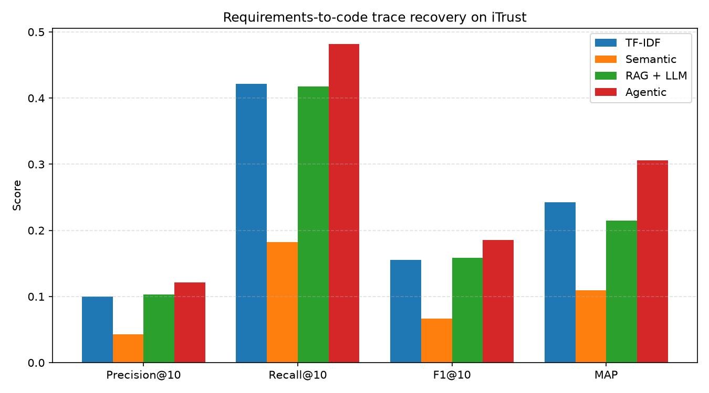
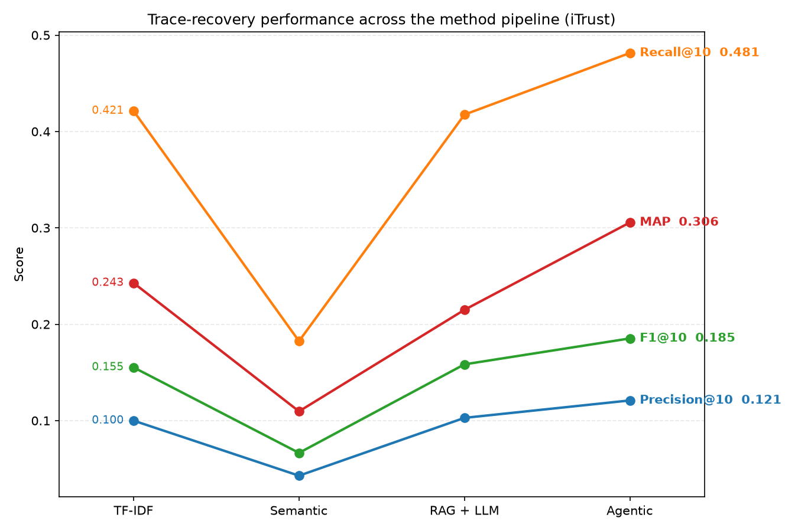

# Results: Requirements-to-Code Trace Recovery on iTrust

This document reports an empirical comparison of four methods for automatically
recovering trace links between requirements and code, evaluated on the CoEST
iTrust dataset (Center of Excellence for Software and Systems Traceability, n.d.).

## Dataset

The iTrust dataset provides natural-language requirements (use cases), Java
source artefacts, and a gold-standard trace matrix of true requirement-to-code
links. After parsing and filtering to requirement-to-Java-code links, the
evaluation set comprises:

- 131 requirement artefacts
- 226 Java code artefacts
- 286 gold-standard trace links (deduplicated; JSP targets excluded)

Of the 131 requirements, 105 have at least one gold link to a Java artefact and
are therefore included in the metric averages.

## Methods

Four methods were implemented and evaluated in a pipeline of increasing
sophistication:

1. **TF-IDF baseline.** A classical vector-space model. Requirements and code
   are represented as TF-IDF vectors over a shared vocabulary, and candidate
   links are ranked by cosine similarity.

2. **Semantic retrieval.** Requirements and code are embedded with
   `nomic-embed-text` (via Ollama) and stored in ChromaDB. Candidates are
   retrieved by embedding cosine similarity.

3. **RAG + LLM verification.** Candidate links from the union of the TF-IDF and
   semantic retrievers are each verified by a local LLM (`llama3.2:3b`), which
   judges whether the code implements the requirement and returns a verdict with
   a confidence score. Candidates are ranked by verdict and confidence.

4. **Agentic layer.** A verifier agent gathers context before deciding. For each
   candidate it may take actions — expanding to the classes referenced by the
   candidate, or retrieving further candidates — up to a fixed step budget,
   before issuing a final verdict. Classes discovered during expansion are
   folded into the candidate set, allowing indirect links to be recovered.

## Metrics

All methods are evaluated with the same procedure. Precision, recall and F1 are
reported at a cut-off of k = 10 retrieved candidates per requirement. Mean
average precision (MAP) is computed over the ranking and is the primary metric,
as it rewards placing true links high in the ranking.

## Results

| Method      | Precision@10 | Recall@10 | F1@10  | MAP    |
|-------------|--------------|-----------|--------|--------|
| TF-IDF      | 0.100        | 0.421     | 0.155  | 0.243  |
| Semantic    | 0.043        | 0.183     | 0.067  | 0.110  |
| RAG + LLM   | 0.103        | 0.418     | 0.158  | 0.215  |
| **Agentic** | **0.121**    | **0.481** | **0.185** | **0.306** |

## Discussion

The results do not follow a simple monotonic improvement, and this is the
central finding.

**The TF-IDF baseline is strong.** On this dataset, requirement and code
artefacts share substantial literal vocabulary (class names echo domain terms
such as *patient*, *appointment* and *prescription*), which lexical matching
exploits directly. Its MAP of 0.243 is consistent with values reported for
TF-IDF on iTrust in the traceability literature.

**Naive semantic retrieval underperforms the baseline.** Embedding whole
artefacts with a general-purpose text model roughly halves both MAP and recall.
The embedding space smooths away the exact-token signal that TF-IDF relies on,
and `nomic-embed-text` is not trained to align natural-language requirements with
Java source. This is a documented difficulty for dense retrieval on code.

**Single-shot LLM verification recovers, but does not beat, the baseline.**
Verifying the union of retrieved candidates restores precision and recall to
baseline levels, but MAP remains below TF-IDF (0.215 vs 0.243). The verifier's
coarse verdict-plus-confidence score produces many ties, degrading the fine
ranking that TF-IDF's continuous similarity provides.

**The agentic layer is the only method to exceed the baseline on every metric.**
By expanding a candidate to the classes it references, the agent surfaces
*indirect* links that no flat retriever can reach — for example, recovering the
data-access and transaction classes that a top-level action class depends on.
This lifts recall to 0.481 (the highest of any method) and MAP to 0.306, a
relative improvement of approximately 26% over the TF-IDF baseline.

That RAG could not beat the baseline while the agentic layer could indicates the
gain comes from the agent's context-gathering design, not merely from adding an
LLM to the pipeline.

## Limitations

- **Small local model.** Verification uses a 3-billion-parameter model running
  locally. During development it showed a verdict-instability and yes-bias:
  prompt phrasing shifted the rate of positive verdicts substantially without
  reliably improving their accuracy. Testing a higher-precision quantisation of
  the same model (`llama3.2:3b-instruct-q8_0`) did not improve verdict accuracy,
  suggesting the bottleneck is model scale rather than quantisation. Larger or
  code-specialised models may verify more reliably.

- **Whole-file embedding with truncation.** Code artefacts are embedded as
  single units and truncated (4,000 characters for retrieval, 2,000 for
  verification) to stay within context limits. Links whose evidence lies in the
  truncated tail of a long file may be missed. Finer-grained chunking is a
  natural extension.

- **Single dataset.** Results are reported on iTrust only. Generalisation to
  other CoEST datasets (for example EBT or eTour) is not yet established.

- **Structural expansion is lexical.** The agent's expansion identifies
  referenced classes by matching known class identifiers as tokens in the
  source, rather than by full static analysis. This is lightweight but may miss
  or over-include references. A parser-based dependency graph (the subject of the
  companion knowledge-graph project) would be more precise.

- **Cost.** The agentic method is substantially slower than the others, making
  several LLM calls per candidate. The accuracy gain comes at a real
  computational cost.

## References

Center of Excellence for Software and Systems Traceability (CoEST) (n.d.)
*Traceability datasets*. Available at:
http://sarec.nd.edu/coest/datasets.html (Accessed: 8 September 2026).

Fuchß, D. et al. (2025) 'LiSSA: Toward generic traceability link recovery through
retrieval-augmented generation', in *Proceedings of the IEEE/ACM 47th
International Conference on Software Engineering (ICSE '25)*. IEEE/ACM.

Hey, T., Fuchß, D., Keim, J. and Koziolek, A. (2025) 'Requirements traceability
link recovery via retrieval-augmented generation', in *Requirements Engineering:
Foundation for Software Quality (REFSQ 2025)*. Lecture Notes in Computer Science.
Cham: Springer.